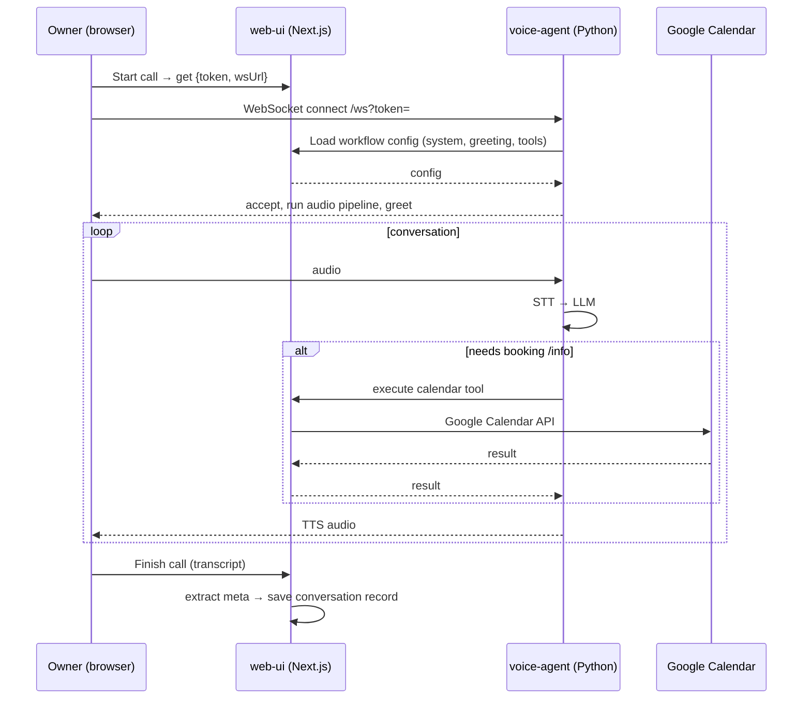

# Architecture

A missed call lands on a business number; an AI voice agent picks it up, has a
spoken conversation, collects the details the business configured, books
calendar slots when a time is confirmed, and saves a record the owner can
follow up on.

Two applications cooperate:

- **`web-ui/`** (Next.js + PostgreSQL) — owner-facing app. Configures businesses,
  workflows, and Google Calendar; hosts the text and voice simulators; owns the
  database and exposes a small HTTP bridge the voice agent uses.
- **`voice-agent/`** (Python + FastAPI + Pipecat) — real-time audio server.
  One WebSocket per call: `audio → STT → LLM → TTS → audio`, with Silero VAD
  for barge-in. Stateless — it loads call context and executes tools by calling
  back into the web app over short-lived signed tokens.

## System diagram

```
                  ┌──────────────────────────────────────────────┐
   Owner          │                web-ui (Next.js)              │
   (browser) ───► │  auth · business/workflow builder            │
                  │  text + voice simulator · records · calendar │
                  │  HTTP bridge: call context & tool execution  │
                  │  database (PostgreSQL, Drizzle)              │
                  └───────────────┬──────────────────────────────┘
                         WS       │ HTTP
                  ┌───────────────┴────────────────┐
                  │      voice-agent (Python)      │
                  │  ws://.../ws   pipecat pipeline│
                  │  STT → LLM → TTS, VAD barge-in │
                  └────────────────────────────────┘
```

## Call flow (simple)

1. Owner starts a call in the simulator. The web app creates a conversation
   record and returns a `{ token, wsUrl }` — the token is a 10-minute HMAC
   signed with `VOICE_AGENT_SECRET`, carrying `call_id`, `workflow_id`,
   `user_id`.
2. The browser connects the WebSocket to `wsUrl`, passing the token.
3. The voice agent validates the token, loads the workflow config (system
   prompt, language, greeting, available tools) from the web app, and starts
   the audio pipeline.
4. The agent converses. Speech → STT → LLM → TTS → audio. When a time is
   proposed, the agent confirms it with the caller, then books via calendar
   tools (executed server-side in the web app through the same tool layer the
   chat simulator uses).
5. The call closes with the configured closing message. The web app extracts
   intent/summary/collected fields/urgency from the transcript with an LLM call
   and finalizes the conversation record.

## Sequence diagram



## Key design points

- **One system prompt everywhere** — built from business + workflow + fields
  (`web-ui/src/lib/agent/prompt.ts`), shared verbatim by the chat simulator,
  the voice agent, and post-call extraction, so all three behave alike.
- **Tools live in the web app** — the voice agent forwards tool calls over a
  short-lived signed token; the web app executes them (e.g. calendar) with the
  same `ToolSet` as the chat simulator.
- **LLM-agnostic** — everything speaks any OpenAI-compatible endpoint
  (`LLM_API_KEY` / `LLM_API_ENDPOINT` / `LLM_MODEL`).
- **Protobuf frames** — the browser uses a serializer (`web-ui/src/lib/agent/
  protobuf-frame-serializer.ts`) that mirrors the Python frame schema so
  barge-in/interruption frames don't break the client.
- **Multi-tenant safe** — every request verifies ownership against the logged-in
  user and validates the signed token before touching data.

See `database-schema.md` for the data model. See `README.md` for setup and
quick start.